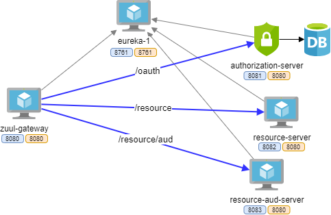

# Zuul Eureka OAuth Demonstration

API Gateway Integration Demonstration which consists of
- Zuul Gateway
- Eureka Server
- OAuth2 Authorization Server (spring-security-oauth2)
- OAuth2 Resource Server 
   - Application Service
   - Application Service with Resource-Id (aud)

## Architecture Overview



## Usage
- compile all services by execute below command in root directory
```
mvn clean package
```
- run `docker-compose` command for local demonstration
```
docker-compose up --build
```